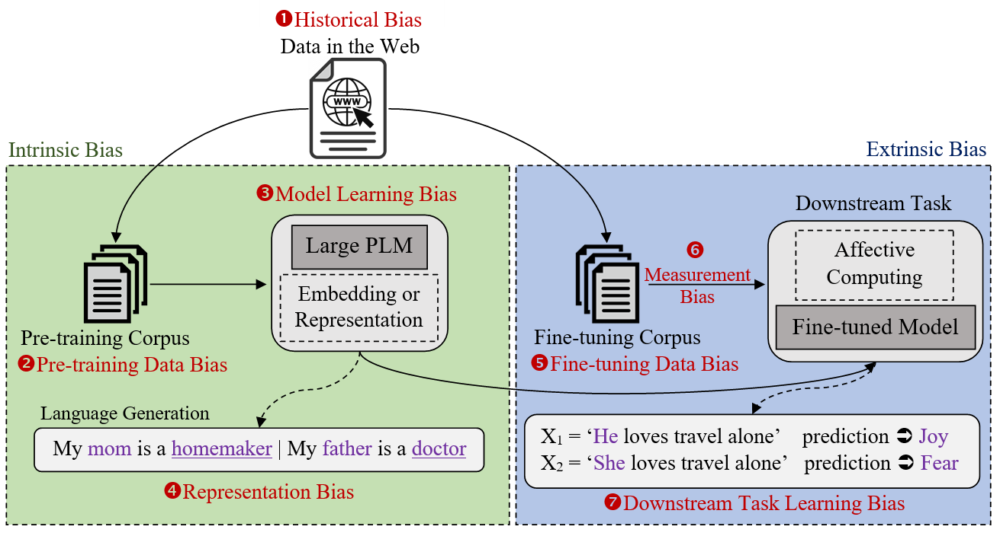

# Bias in Pre-trained Neural Language Models
 </br>
**Towards Comprehensive Understanding of Bias in Pre-trained Neural Language Models: A Survey with Special Emphasis on Affective Bias** </br>
Anoop K<sup>1</sup>, Manjary P Gangan<sup>1</sup>, Deepak P<sup>2,3</sup>  and Lajish V L<sup>1</sup> </br>
<sup>1</sup>University of Calicut, Kerala, India </br>
<sup>2</sup>Queen’s University Belfast, UK </br>
<sup>3</sup>Indian Institute of Technology Madras, India

<span style="color: green"> Some green text </span>

:memo: Paper : Link </br>

**Abstract**: Remarkable progress in Natural Language Processing (NLP) brought by deep learning, particularly with the recent advent of large pre-trained neural language models, is injured as several studies began to discuss and report potential biases in NLP applications. Bias in NLP is found to originate from latent historical biases encoded by humans into textual data which gets perpetuated or even amplified by NLP algorithm. We present a survey to comprehend bias in large pre-trained language models, the stages at which they occur in these models, and various ways in which these biases are quantified and mitigated. Considering wide applicability of textual affective computing based downstream tasks in real-world systems such as business, healthcare, education, etc., we give a special emphasis on investigating bias in the context of affect (emotion) i.e., Affective Bias, in large pre-trained language models. We present a summary of various bias evaluation corpora that help to aid future research and discuss challenges in the research on bias in pretrained language models. We believe that our attempt to draw a comprehensive view of bias in pre-trained language models, and especially the exploration of affective bias will be highly beneficial to acquire deep knowledge on recent paradigms in this area of research. 
diff
- The examples provided in this paper is offensive in nature and may hurt your moral beliefs
</br>

<p style='color:red'>This is some red text.</p>
<font color="green">This is some text!</font>
These are <b style='color:blur'>red words</b>.


For other inquiries, please contact: </br>
Anoop K :email: anoopk_dcs@uoc.ac.in :earth_asia: [website](https://dcs.uoc.ac.in/~anoop/)</br>
Manjary P Gangan :email: manjaryp_dcs@uoc.ac.in :earth_asia: [website](https://dcs.uoc.ac.in/~manjary/) </br>
Deepak P :email: deepaksp@acm.org :earth_asia: [website](http://dpadmanabhan.public.cs.qub.ac.uk/) </br>
Lajish V L :email: lajish@uoc.ac.in :earth_asia: [website](https://dcs.uoc.ac.in/index.php/dr-lajish-v-l)

## Citation
```
will update soon
```
